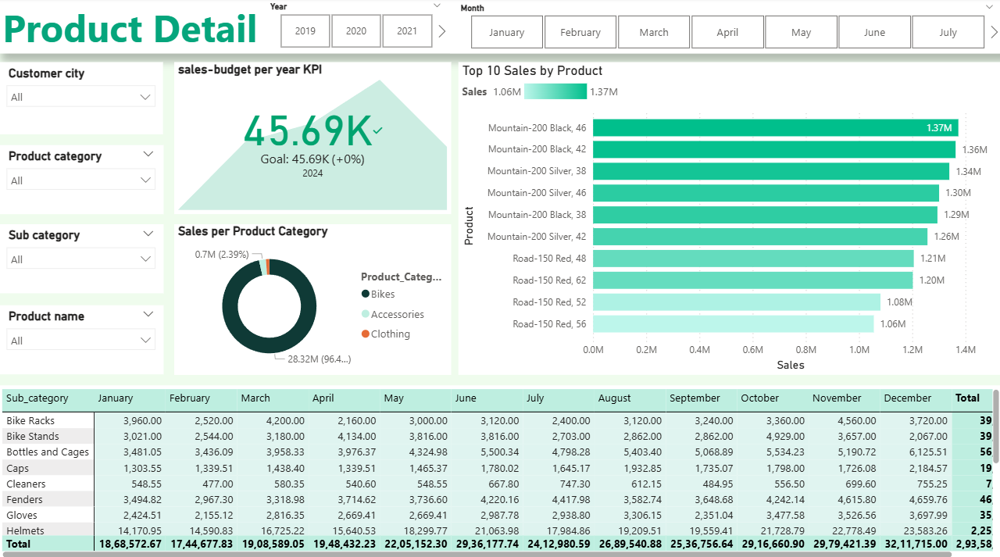
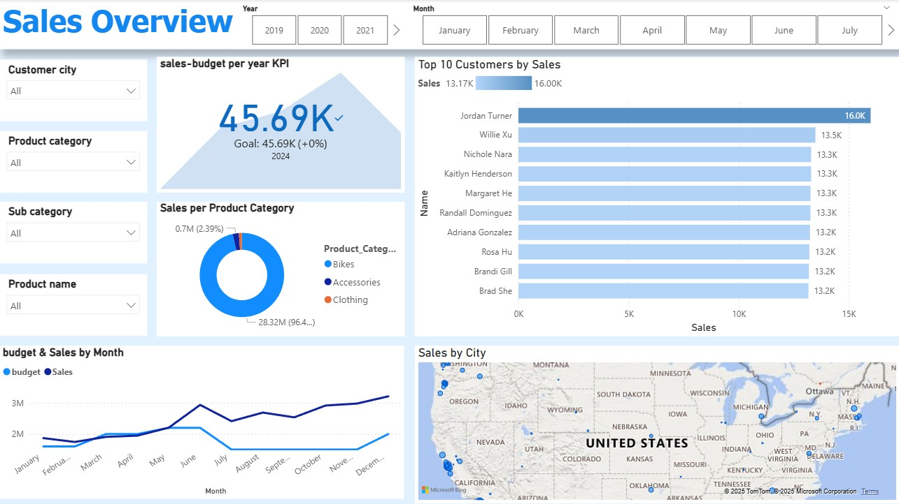

# Sales Performance Dashboard (Power BI)

📊 An interactive **Power BI dashboard** analyzing sales, customers, products, and budget performance.  
This project showcases my skills in **data visualization, data modeling, and SQL-based transformations**.

---

## 📂 Project Structure
sales-performance-dashboard/
- data/
    -   customer_geography.csv
    -   dim_date.csv
    -   products.csv
- sql/
    -   dim_customer_geography_join.sql
    -   dim_date_transformations.sql
    -   dim_product_transformations.sql
- dashboard/
    -   sales_dashboard.pbix
    -   dashboard_screenshot.jpg
- sales_budget.xlsx
- README.md
- LICENSE

---

## 🚀 Features
- **Sales vs. Budget KPIs** – Compare actual sales performance against budgeted targets.  
- **Product & Customer Insights** – Identify top-performing products and high-value customers.  
- **Geographic Analysis** – Sales by city and region using map visuals.  
- **Trend Analysis** – Monthly and yearly sales trends.  
- **Data Modeling** – SQL transformations applied on raw data before visualization.  

---

## 🛠 Tools Used
- **Power BI Desktop** (dashboard & visualization)  
- **SQL Server** (data transformation scripts)  
- **Excel/CSV** (source data)  

---

## 📊 Dashboard Preview
### Product Detail 

### Sales Overview

---

## 📥 How to Open
1. Download this repository (`Code > Download ZIP`).  
2. Extract the files and open `dashboard/sales_dashboard.pbix` in **Power BI Desktop**.  
3. If prompted, re-link data sources from the `data/` folder via **Transform Data > Data Source Settings**.  
4. Refresh to load the latest visuals.  

---

## ⭐ Highlights
This project demonstrates:
- Building an **end-to-end BI solution** from raw data → SQL transformations → interactive Power BI dashboard.  
- Strong understanding of **DAX measures, KPIs, and visual storytelling**.  
- Practical use of **data cleaning and integration** for business insights.  

---
